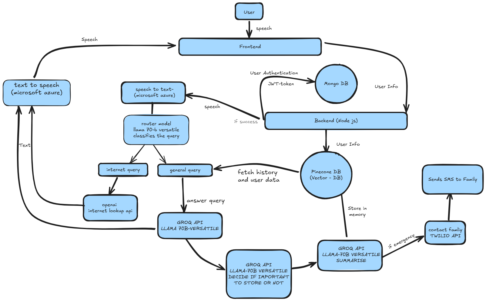

# 🧠 VoiceCare AI

<p align="center">
  
  
  
  
  
  
  
</p>

An empathetic, voice-first AI assistant for elderly care, featuring proactive caregiver alerts and personalized long-term memory.

## 📋 Table of Contents
- [Demo & Resources](#demo--resources)
- [Project Vision](#project-vision)
- [Key Features](#key-features)
- [Tech Stack](#tech-stack)
- [Architectural Overview](#architectural-overview)
- [Installation](#installation)
- [Environment Setup](#environment-setup)
- [Usage](#usage)
- [API Endpoints](#api-endpoints)
- [Project Structure](#project-structure)
- [Future Improvements](#future-improvements)
- [Contributing](#contributing)
- [License](#license)

## 🎥 Demo & Resources

- **🎬 Demo Video**: [Watch the working project demo](https://drive.google.com/file/d/16vjceiI63eFPCwdstRuSAGiO1G8zpuIf/view?usp=sharing)
- **🐍 Python Backend Code**: [View on GitHub](https://github.com/jatinagrawal-py/voicecare_python)

## 💡 Project Vision

VoiceCare AI is an intelligent, voice-first assistant designed to offer compassionate support to elderly users, including those with cognitive challenges like dementia. It creates a personalized memory for each user and proactively monitors conversations to detect critical information, alerting caregivers in real time.

**The goal is to enhance user independence while giving caregivers peace of mind.**

## ✨ Key Features

### 🧠 **Personalized Long-Term Memory**
- Remembers personal details (medical history, medications, appointments, family members)
- Uses Pinecone vector database for efficient RAG (Retrieval-Augmented Generation)
- Dynamic learning that updates user profiles in real-time

### 🚨 **Proactive Caregiver Alerts**
- Detects emergency phrases like "I fell" or "I feel dizzy"
- Automatically sends concise alerts to caregivers via Twilio SMS
- Background monitoring system for continuous safety

### 🗣️ **Empathetic & Simple Conversations**
- Uses simple, reassuring language ideal for elderly users
- Specially designed for users with dementia
- Natural conversation flow with context awareness

### 🌐 **Intelligent Query Routing**
- Automatically distinguishes between queries answerable via internal memory
- Routes complex queries requiring real-time web access appropriately
- Llama 70-B model for versatile query classification

### ⚡ **High-Speed Responses**
- Leverages Groq API for ultra-fast LLM inference
- Enables smooth, natural conversation flow
- Optimized for real-time voice interactions

## 🛠️ Tech Stack

| Category | Technology / Service |
|----------|---------------------|
| **Backend** | Flask (Python), Node.js/Express |
| **AI & LLMs** | OpenAI (GPT-4o, Embeddings), Groq (Llama 70-B) |
| **Database** | Pinecone (Vector DB for RAG), MongoDB |
| **Notifications** | Twilio (SMS API) |
| **Authentication** | JWT, bcrypt |
| **Primary Language** | Python, JavaScript |
| **Deployment** | Cloud-based platform |

## 🏗️ Architectural Overview



VoiceCare AI follows a modular RAG (Retrieval-Augmented Generation) architecture:

1. **Voice Input Processing** → Microsoft Azure Speech-to-Text
2. **Query Classification** → Llama 70-B via Groq (General Query vs Internet Lookup)
3. **Memory Retrieval** → Pinecone Vector Database search
4. **Response Generation** → GPT-4o with context-aware prompting
5. **Emergency Detection** → Background monitoring with SMS alerts
6. **Voice Output** → Microsoft Azure Text-to-Speech

Information flows from the user's voice input through intelligent memory and processing layers, with a parallel background monitoring system that triggers alerts as needed.

## 🚀 Installation

### Prerequisites
- Python 3.9+
- Node.js 16+
- MongoDB
- API Keys for: OpenAI, Groq, Pinecone, Twilio, Microsoft Azure

### Python Backend Setup

1. **Clone the Python repository**:
   ```bash
   git clone https://github.com/jatinagrawal-py/voicecare_python.git
   cd voicecare_python
   ```

2. **Create virtual environment**:
   ```bash
   python -m venv venv
   source venv/bin/activate  # On Windows: venv\Scripts\activate
   ```

3. **Install dependencies**:
   ```bash
   pip install -r requirements.txt
   ```

### Node.js Backend Setup

1. **Navigate to backend directory**:
   ```bash
   cd backend
   ```

2. **Install dependencies**:
   ```bash
   npm install
   ```

## ⚙️ Environment Setup

### Python Backend (.env)
```env
# OpenAI Configuration
OPENAI_API_KEY=your_openai_api_key
EMBEDDING_MODEL_OPENAI=text-embedding-ada-002
SEARCH_MODEL=gpt-4o

# Groq Configuration
GROQ_API_KEY=your_groq_api_key
ROUTER_MODEL=llama-70b-versatile
SUMMARY_MODEL_NAME=llama-70b-versatile

# Pinecone Configuration
PINECONE_API_KEY=your_pinecone_api_key

# Twilio Configuration
TWILIO_SID=your_twilio_sid
TWILIO_TOKEN=your_twilio_token

# Server Configuration
PORT=4000
DEBUG=False
```

### Node.js Backend (.env)
```env
# Database
DBCONNECTION=your_mongodb_connection_string

# JWT
JWT_SECRET=your_jwt_secret

# Server
PORT=3000
```

## 🎯 Usage

### Starting the Services

1. **Start Python Flask Server**:
   ```bash
   python main.py
   ```

2. **Start Node.js Server**:
   ```bash
   cd backend
   npm start
   ```

3. **Access the application**:
   - Python API: `http://localhost:4000`
   - Node.js API: `http://localhost:3000`

### Basic Workflow

1. **User Registration**: Create account through `/voicecare-signup`
2. **Profile Setup**: Submit user information via `/voicecare-form`
3. **Voice Interaction**: Send audio/text to `/voicecare-processing`
4. **Emergency Monitoring**: Automatic background processing
5. **Caregiver Alerts**: SMS notifications for emergencies

## 📡 API Endpoints

### Authentication Endpoints (Node.js)
```
POST /voicecare-signup    # User registration
POST /voicecare-login     # User authentication
GET  /voicecare-ai        # Get user profile
GET  /voicecare-logout    # User logout
POST /voicecare-form      # Submit user information
```

### AI Processing Endpoints (Python)
```
POST /voicecare-processing  # Main AI conversation endpoint
POST /voicecare-form       # Store user profile data
```

### Request/Response Examples

**Conversation Processing**:
```json
POST /voicecare-processing
{
  "text": "What medications do I take in the morning?",
  "user_id": "user123"
}

Response:
{
  "response": "Based on your profile, you take Lisinopril 10mg and Vitamin D 1000 IU every morning with breakfast."
}
```

## 📁 Project Structure

```
voicecare-ai/
├── 📁 Python Backend (AI Processing)
│   ├── main.py                 # Flask application entry point
│   ├── chatbot_1.py           # Main conversation logic
│   ├── router.py              # Query classification
│   ├── embeddings.py          # OpenAI embeddings
│   ├── longterm_memory.py     # Memory summarization
│   ├── summary_upsertion.py   # Pinecone operations
│   ├── vectordb_upsertion.py  # Vector database management
│   ├── messaging.py           # Twilio SMS integration
│   └── requirements.txt       # Python dependencies
│
├── 📁 Node.js Backend (Auth & Data)
│   ├── server.js              # Server entry point
│   ├── app.js                 # Express application
│   ├── 📁 controllers/        # Request handlers
│   ├── 📁 models/             # Database schemas
│   ├── 📁 routes/             # API routes
│   ├── 📁 services/           # Business logic
│   ├── 📁 middlewares/        # Authentication middleware
│   └── package.json           # Node.js dependencies
│
└── README.md                  # This file
```

## 🔧 Key Components

### 1. **Conversation Engine** (`chatbot_1.py`)
- Handles user queries with context awareness
- Integrates with Pinecone for memory retrieval
- Routes between general knowledge and web search

### 2. **Query Router** (`router.py`)
- Classifies queries using Llama 70-B model
- Determines if query needs internet access or can use stored knowledge

### 3. **Memory System** (`longterm_memory.py`, `summary_upsertion.py`)
- Summarizes conversations for important information
- Stores health updates, medication changes, appointments
- Triggers emergency alerts when needed

### 4. **Emergency Detection**
- Background monitoring of conversations
- Automatic SMS alerts to caregivers
- Configurable emergency phrases and contacts

## 🎨 Future Improvements

### ✅ **Frontend Interface**
- Build a simple web or mobile interface for users and caregivers
- Voice-activated interface with large, accessible buttons

### ✅ **Caregiver Dashboard**
- Portal to view conversation summaries and health updates
- Manage user profiles and emergency contacts
- Historical data visualization and trends

### ✅ **Vocal Tone Analysis**
- Analyze speech tone to detect distress, confusion, or pain
- Enhanced alert system with severity levels
- Emotional state tracking over time

### ✅ **Multi-Language Support**
- Enable conversations in multiple languages
- Cultural adaptation for global accessibility
- Localized emergency protocols

### ✅ **Smart Home Integration**
- Control smart devices (lights, thermostats, emergency systems)
- Voice commands for home automation
- Safety monitoring through IoT sensors

### ✅ **Advanced Health Monitoring**
- Integration with wearable devices
- Medication reminder system
- Appointment scheduling and reminders

## 🤝 Contributing

We welcome contributions to VoiceCare AI! Here's how you can help:

1. **Fork the repository**
2. **Create a feature branch**: `git checkout -b feature/amazing-feature`
3. **Commit your changes**: `git commit -m 'Add amazing feature'`
4. **Push to the branch**: `git push origin feature/amazing-feature`
5. **Open a Pull Request**

### Development Guidelines
- Follow PEP 8 for Python code
- Use ESLint configuration for JavaScript
- Add tests for new features
- Update documentation for API changes

## 📄 License

This project is licensed under the MIT License - see the [LICENSE](LICENSE) file for details.

## 🙏 Acknowledgments

- OpenAI for GPT-4o and embedding models
- Groq for fast LLM inference
- Pinecone for vector database services
- Twilio for SMS communication
- Microsoft Azure for speech services

## 📞 Support

For support, questions, or feature requests:
- Create an issue on GitHub
- Contact the development team
- Check the documentation and API guides

---

<p align="center">
  <strong>Built with ❤️ for elder care and family peace of mind</strong>
</p>
